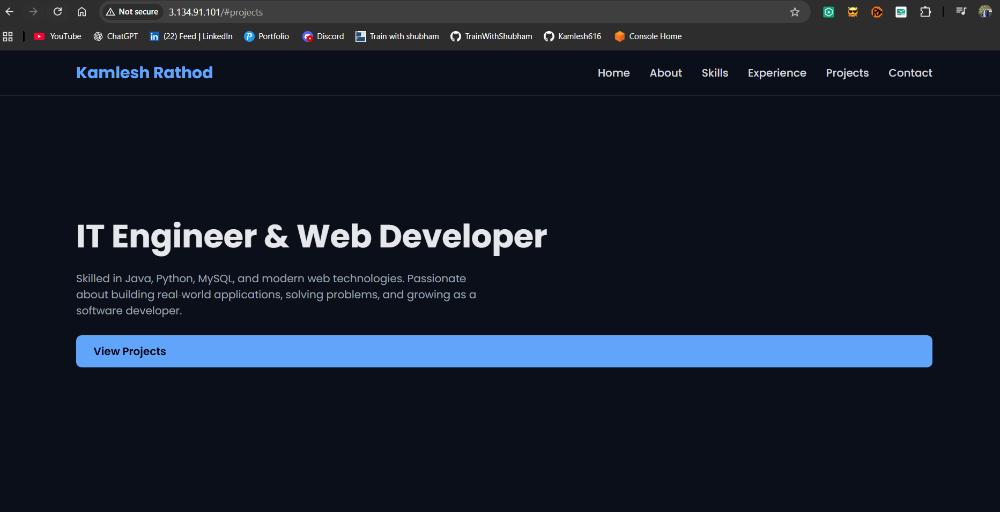

# ☁️ Deploying Website on AWS EC2 using Nginx

## 📌 Task Objective
Deploy a static website on a cloud server using AWS EC2, configure Nginx, allow web access, and verify it is accessible from the internet.

---

# 🚀 Steps Performed

## 1️⃣ Launch Cloud Instance
- Launched an AWS EC2 instance.
- Selected Ubuntu OS.
- Created and downloaded key pair (.pem file).

---

## 2️⃣ Connect to Server using SSH

```bash
ssh -i your-key.pem ubuntu@your-public-ip
```

✔ Successfully connected to the EC2 instance.

---

## 3️⃣ Install Nginx

```bash
sudo apt update
sudo apt install nginx -y
```

✔ Nginx installed successfully.

Check Nginx status:

```bash
sudo systemctl status nginx
```

---

## 4️⃣ Configure Security Group

- Opened **Port 80 (HTTP)** in Security Group.
- Allowed inbound traffic from:
  ```
  0.0.0.0/0
  ```
✔ Website accessible from internet.

---

## 5️⃣ Add Website Code to Nginx

Moved website files to:

```bash
/var/www/html
```

Example:

```bash
sudo rm -rf /var/www/html/*
sudo cp -r * /var/www/html/
```

Restart Nginx:

```bash
sudo systemctl restart nginx
```

✔ My portfolio website is now hosted using Nginx.

---

## 6️⃣ Extract and Save Logs

Check access logs:

```bash
cd /var/log/nginx
ls
```

Save logs to file:

```bash
sudo cp access.log mylogs.txt
```

✔ Logs successfully extracted.

---

## 7️⃣ Verify Website from Internet

Opened browser and accessed:

```
http://your-public-ip
```

✔ Website successfully loaded.

---

# 🖼 Output Screenshot

My deployed website running on EC2 with Nginx:

(Add your screenshot image here in GitHub repo)

Example:

```markdown

```

---

# 🧠 What I Learned

- How to launch EC2 instance
- How to connect using SSH
- How to install and configure Nginx
- How to open security group ports
- How to check and extract logs
- How to deploy static website on cloud

---

# 💡 Tools Used

- AWS EC2
- Ubuntu Server
- SSH
- Nginx
- Linux Commands

---

# 🎯 Conclusion

Successfully deployed a website on AWS EC2 using Nginx and made it accessible over the internet.

This task helped me understand:
- Cloud basics
- Server configuration
- Web server setup
- Security group configuration
- Log monitoring

---

## 👨‍💻 Author

Kamlesh Rathod  
IT Engineer | DevOps Learner
